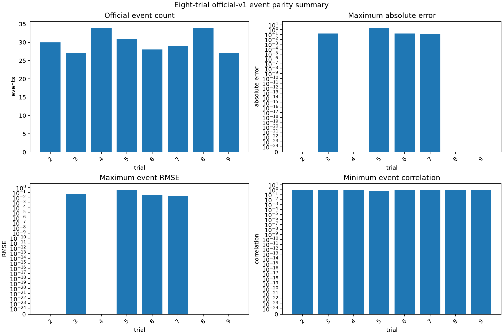
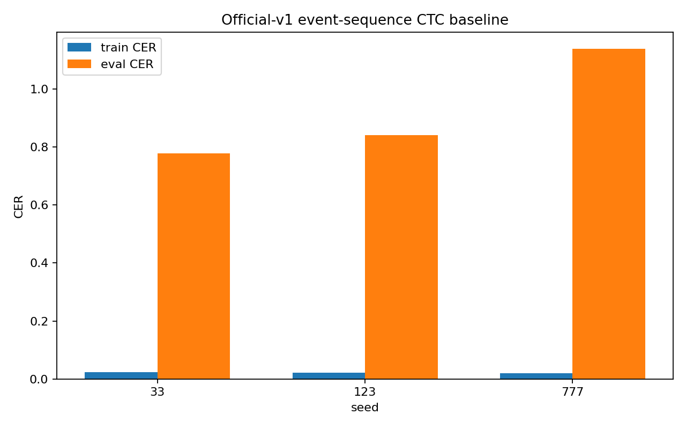
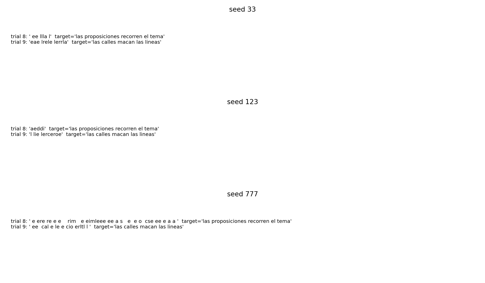
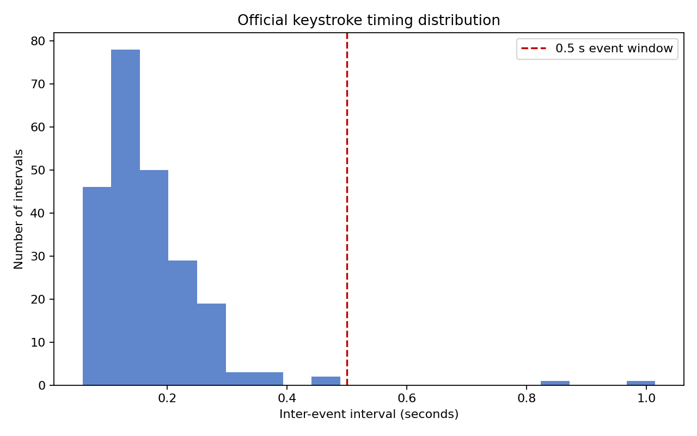
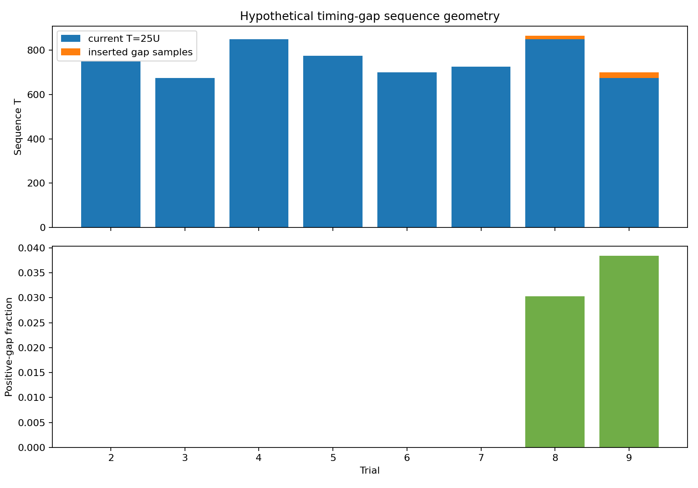

# NeuroSelect

NeuroSelect is a reproducible research codebase for non-invasive neural
signal-to-text experiments. It currently provides a compact character-level
CTC baseline over public SpanishBCBL/DECOMEG MEG data.

Research hypothesis for later phases:

> Can selectively conditioning an LLM on temporally localized neural evidence
> improve faithfulness of non-invasive brain-to-text decoding compared with
> uniformly providing neural representations to the language model?

This repository currently builds the data and baseline foundation only. It
does **not** implement the Evidence Selector, LLM conditioning, LoRA,
uncertainty estimation, active calibration, or product UI.

## Current status

| Area | Status |
|---|---|
| Synthetic CTC sanity check | Passed |
| Public dataset audit | Completed |
| Official SpanishBCBL event extraction | Passed on S22 subset |
| SpanishBCBL label mapping | Verified |
| Real-data signal extraction | Completed for 8 trials |
| One-trial forward pass + finite CTC loss | Passed |
| Real-data alignment audit | Completed |
| CTC geometry audit | All selected trials structurally feasible |
| Tiny real-data overfit | Not yet successful |
| Scientific real CER/WER benchmark | Not reported |
| Evidence Selector / LLM | Not implemented |

Current forensic conclusion:

**NOT YET ESTABLISHED** that the complete real-data problem is technically
learnable by the compact baseline. Mapping, event alignment, target encoding,
and CTC geometry are valid. A short-window filtering mismatch was found and
fixed. Model/optimization learnability remains unresolved.

## Dataset and access

Brain2Qwerty v2 data is documented as embargoed by its official repository.
NeuroSelect therefore uses the public SpanishBCBL/DECOMEG release:

- Dataset: <https://huggingface.co/datasets/bcbl190626/SpanishBCBL>
- License: CC BY-NC 4.0, subject to dataset terms
- Official code: <https://github.com/facebookresearch/brain2qwerty>
- Vendored official revision: `5f9889621d0df391c5aab37c996683d308e6e926`
- Full public archive: approximately 262 GB

Only one small MEG recording block was downloaded locally:

```text
MEG/FIF/22_9788/231214/block1.fif
MEG/logs/S22-session1_block1_list1.mat
```

Raw and processed neural recordings are excluded from Git by `.gitignore`.
Users must obtain data through permitted official access before running
real-data preparation.

## Real subset

The current local subset represents:

- Subject: S22
- Session: 1
- Block: block1
- Modality: MEG
- Original sampling rate: 1000 Hz
- Channels: 306 MEG
- Selected production trials: 8
- Processed sampling rate: 50 Hz
- Processed arrays: `(time, channels)` float32 `.npy`

Generated local artifacts:

```text
data/processed/spanishbcbl_subset/manifest.jsonl
data/manifests/spanishbcbl_meg_subset.csv
data/raw/spanishbcbl_s22/events_clean.pkl
results/real_data_alignment_examples.json
results/figures/spanishbcbl_trial_002.png
```

## Installation

### Conda

```powershell
conda env create -f environment.yml
conda activate neuroselect
$env:PYTHONPATH="src"
```

### pip / virtual environment

```powershell
python -m venv .venv
.venv\Scripts\Activate.ps1
python -m pip install --upgrade pip
python -m pip install -r requirements.txt
$env:PYTHONPATH="src"
```

Official event extraction additionally requires the installed
`neuralset`, `neuralfetch`, `exca`, `mne`, and related Brain2Qwerty
dependencies. The pinned upstream dependency specification is available at:

```text
vendor/brain2qwerty/pyproject.toml
vendor/brain2qwerty/requirements.lock
```

## Tests

Run NeuroSelect tests:

```powershell
$env:PYTHONPATH="src"
python -m pytest -q tests
```

The current NeuroSelect suite covers:

- generic vocabulary encoding/decoding
- verified SpanishBCBL mapping
- real-style JSONL manifest loading
- signal shape and finite-value checks
- Conv1D + BiGRU + CTC dimensions
- CTC loss compatibility
- CER/WER
- duplicate-text split protection
- repeated-label CTC geometry

Vendored Brain2Qwerty tests are separate. Some require optional dependencies
such as `Levenshtein` and `neuraltrain`; they are not part of the NeuroSelect
test gate.

## Baseline model

```text
(batch, time, channels)
        ↓
Conv1D + GELU
        ↓
Conv1D + GELU
        ↓
bidirectional GRU
        ↓
linear vocabulary head
        ↓
CTC loss
```

Source:

```text
src/neuroselect/models.py
src/neuroselect/training.py
src/neuroselect/data.py
```

The SpanishBCBL vocabulary contains 30 classes:

- CTC blank
- 28 official character/symbol classes
- `<space>` mapped to space
- `<special>` mapped to `@`
- `<number>` mapped to `9`

Mapping details:

```text
src/neuroselect/vocab_spanishbcbl.py
docs/DATASET_MAPPING.md
```

## Prepare real data

Run from repository root after placing permitted raw files under
`data/raw/spanishbcbl_s22/`:

```powershell
$env:PYTHONPATH="vendor\brain2qwerty;src"
python scripts\prepare_real_subset.py data\raw\spanishbcbl_s22
```

Pipeline:

```text
raw FIF + MATLAB log
→ official Brain2Qwerty event extraction
→ official sentence/keystroke preprocessing
→ continuous MEG filtering: 0.1–20 Hz
→ resampling: 50 Hz
→ continuous-recording RobustScaler
→ official sentence crop
→ baseline correction + clamp ±5
→ `.npy` signal windows + JSONL/CSV manifests
```

The script preserves official event boundaries and uses
`sentence_typed` as target text. It does not download data automatically.

## Run synthetic sanity check

```powershell
$env:PYTHONPATH="src"
python scripts\sanity_check.py
```

Expected behavior: synthetic CTC loss decreases strongly on a tiny encoded
example. This validates tensor flow and optimization mechanics, not neural
decoding quality.

## Run real-data forensics

The Phase 3 diagnostic runner audits one real-data path end to end:

```powershell
$env:PYTHONPATH="vendor\brain2qwerty;src"
python scripts\real_baseline_forensics.py data\raw\spanishbcbl_s22 --epochs 100
```

Outputs:

```text
results/real_baseline_debug_trial.json
results/mapping_reconstruction_examples.json
results/alignment_audit.json
results/preprocessing_statistics.json
results/ctc_geometry_report.json
results/optimization_diagnostic.json
results/figures/debug/
```

Diagnostics include:

- raw-to-target trace for one trial
- official label reconstruction
- event timestamps and inter-event density
- signal-stage statistics
- CTC `T`, `U`, `T/U`, repeated-label checks
- learning-rate comparison
- clipping comparison
- normalization comparison
- random-target control
- artificial-target control

## Train and evaluate baseline

Training entry point:

```powershell
$env:PYTHONPATH="src"
python -m neuroselect.training data\processed\spanishbcbl_subset\manifest.jsonl `
  --epochs 10 `
  --batch-size 2 `
  --hidden 64 `
  --output results\checkpoint.pt
```

Evaluation entry point:

```powershell
$env:PYTHONPATH="src"
python scripts\evaluate.py `
  data\processed\spanishbcbl_subset\manifest.jsonl `
  results\checkpoint.pt `
  --output results\baseline_metrics.json `
  --examples results\baseline_predictions.txt
```

Do not interpret metrics from this eight-trial, one-subject subset as a
scientific generalization benchmark. Current project policy blocks real
CER/WER reporting until tiny real-data learnability and leakage-safe
evaluation are established.

## Repository layout

```text
src/neuroselect/
  data.py                    Manifest loader, signal dataset, CTC collation
  diagnostics.py             CTC geometry validation
  metrics.py                 CER/WER and edit distance
  models.py                  Compact Conv1D + BiGRU + CTC model
  splitting.py               Duplicate-text-safe split helper
  training.py                Training loop and CLI
  vocab.py                   Generic baseline vocabulary
  vocab_spanishbcbl.py       Verified SpanishBCBL vocabulary

scripts/
  sanity_check.py            Synthetic CTC overfit check
  prepare_real_subset.py     Official event path to local manifests
  real_baseline_forensics.py Phase 3 forensic diagnostics
  evaluate.py                Prediction and metric export

tests/
  test_baseline.py           NeuroSelect regression tests

docs/
  OFFICIAL_PIPELINE.md       Official event-building explanation
  REAL_DATA_PIPELINE.md      Real-data preparation details
  DATASET_MAPPING.md         Label table and reconstruction evidence
  ALIGNMENT_AUDIT.md         Timestamp and event audit
  PREPROCESSING_AUDIT.md     Signal-stage audit
  CTC_GEOMETRY.md            CTC feasibility audit
  LEAKAGE_ANALYSIS.md        Leakage limits and split policy
  COMPUTE_BENCHMARK.md       Runtime observations
```

## Scientific guardrails

- Do not claim Brain2Qwerty v2 data access.
- Do not bypass dataset authentication, embargo, or license restrictions.
- Do not download the full archive for this project phase.
- Do not claim state-of-the-art performance.
- Do not claim novelty before evidence supports it.
- Do not report tiny-subset CER/WER as generalization.
- Do not add Evidence Selector, LLM, calibration, uncertainty, or UI before
  baseline learnability is established.

## Documentation index

- `dataset_audit.md` — access, size, license, and dataset limitations
- `DATASET_CARD.md` — concise dataset summary
- `BASELINE.md` — model scope and current baseline status
- `EXPERIMENT_LOG.md` — phase-by-phase experiment record
- `docs/OFFICIAL_PIPELINE.md` — official source pipeline
- `docs/REAL_DATA_PIPELINE.md` — local extraction path
- `docs/DATASET_MAPPING.md` — verified token mapping
- `docs/ALIGNMENT_AUDIT.md` — event/text alignment findings
- `docs/PREPROCESSING_AUDIT.md` — preprocessing findings
- `docs/CTC_GEOMETRY.md` — sequence feasibility findings
- `docs/LEAKAGE_ANALYSIS.md` — leakage constraints
- `docs/COMPUTE_BENCHMARK.md` — compute observations

## License and attribution

NeuroSelect project files are provided for research use. Public dataset files
remain subject to SpanishBCBL/DECOMEG license and attribution requirements.
The vendored Brain2Qwerty source retains its upstream license and notices in
`vendor/brain2qwerty/LICENSE`.

---

## Validated official-v1 results

The exact official Brain2Qwerty v1 revision is:

```text
5f9889621d0df391c5aab37c996683d308e6e926
```

The gated implementation in `src/neuroselect/official_v1_preprocessing.py`
matches the official event tensors across the complete local development
subset:

| Check | Result |
|---|---:|
| Subject/session/block | S22 / session 1 / block1 |
| Trials | 2–9 |
| Events compared | 240 |
| Exact hash matches | 240/240 |
| Maximum MAE | 0 |
| Maximum RMSE | 0 |
| Maximum absolute error | 0 |
| Channels | 306 |
| Samples per event | 25 |



The validated event pipeline is intentionally separate from the historical
sentence-cropped pipeline. It uses continuous filtering, continuous 50 Hz
resampling, continuous `RobustScaler`, official overlap/index semantics,
event window `[-0.2,+0.3]`, official baseline slicing, and clamp `[-5,+5]`.
It does not zero-pad or silently alter timestamps.

Detailed artifacts:

- [`results/eight_trial_official_v1_parity.json`](results/eight_trial_official_v1_parity.json)
- [`results/four_event_parity_forensics.json`](results/four_event_parity_forensics.json)
- [`results/official_v1_overlap_fix.json`](results/official_v1_overlap_fix.json)
- [`results/figures/debug/eight_trial_event_parity_examples.png`](results/figures/debug/eight_trial_event_parity_examples.png)
- [`results/figures/debug/four_event_parity_forensics.png`](results/figures/debug/four_event_parity_forensics.png)
- [`results/figures/debug/four_event_sample_alignment.png`](results/figures/debug/four_event_sample_alignment.png)

## Model architecture and baseline configuration

The unchanged baseline is:

```text
(batch, time, 306)
  → Conv1D(306 → 64, kernel 5) + GELU
  → Conv1D(64 → 64, kernel 3) + GELU
  → bidirectional GRU(hidden 64)
  → Linear(vocabulary)
  → CTC loss and greedy CTC decoding
```

Source: [`src/neuroselect/models.py`](src/neuroselect/models.py).

The official-v1 event-sequence experiment explicitly adapts event tensors:

```text
(25,306) × U events
        ↓ concatenate along time
(25U,306)
```

This is named `official_v1_event_sequence`. It is not equivalent to the
historical continuous sentence representation. Events remain in official
order; no gaps are inserted; no events are duplicated; no event padding is
used.

Training configuration:

| Parameter | Value |
|---|---:|
| Optimizer | Adam |
| Learning rate | 0.001 |
| Gradient clipping | max norm 1.0 |
| Epochs | 300 |
| Seeds | 33, 123, 777 |
| Training trials | 2–7 |
| Evaluation trials | 8–9 |
| Decoder | Existing greedy CTC decoder |

Shape audit:

| Trial | U | T | Channels | T/U |
|---:|---:|---:|---:|---:|
| 2 | 30 | 750 | 306 | 25 |
| 3 | 27 | 675 | 306 | 25 |
| 4 | 34 | 850 | 306 | 25 |
| 5 | 31 | 775 | 306 | 25 |
| 6 | 28 | 700 | 306 | 25 |
| 7 | 29 | 725 | 306 | 25 |
| 8 | 34 | 850 | 306 | 25 |
| 9 | 27 | 675 | 306 | 25 |

Every sequence satisfied `T=25U` and had zero NaN/Inf values.

## Official-v1 event-sequence CTC results

| Seed | Initial loss | Final/min loss | Train CER | Evaluation CER |
|---:|---:|---:|---:|---:|
| 33 | 75.192 | 0.036 | 0.023 | 0.778 |
| 123 | 74.981 | 0.036 | 0.022 | 0.841 |
| 777 | 73.292 | 0.044 | 0.020 | 1.139 |

Aggregate results:

- train CER: `0.0216 ± 0.0015`;
- evaluation CER: `0.9194 ± 0.1573`;
- historical continuous-sentence train CER reference: `0.169`;
- historical continuous-sentence evaluation CER reference: `0.875`.

The event-sequence model memorizes the six training sentences strongly, but
held-out transfer remains poor and seed-variable. Because the representation
changed, the comparison is not a clean preprocessing-only effect.





Full losses, per-trial predictions, blank probabilities, repetition metrics,
and configuration are in
[`results/official_v1_event_sequence_ctc_baseline.json`](results/official_v1_event_sequence_ctc_baseline.json).

Interpretation: **corrected representation improves training but not transfer**.
This is a development baseline, not a state-of-the-art, subject-independent,
or neural-information claim.

## Timing feasibility audit

Before considering timing-gap insertion, the official event timestamps were
audited without training.

| Split | Intervals | Mean Δt | Median Δt | Overlap fraction | Positive-gap fraction |
|---|---:|---:|---:|---:|---:|
| Train trials 2–7 | 173 | 0.1635 s | 0.1420 s | 100.0% | 0.0% |
| Evaluation trials 8–9 | 59 | 0.1910 s | 0.1660 s | 96.6% | 3.4% |





All training intervals produce zero additional samples under:

```text
gap_samples = max(0, round(delta_t * 50) - 25)
```

Only two evaluation intervals produce positive gaps. The timing-gap idea was
classified as unlikely to be informative for this subset. Since it uses true
keystroke timestamps, it is an offline oracle diagnostic and is not
automatically deployable brain-to-text input.

Audit: [`results/inter_event_timing_audit.json`](results/inter_event_timing_audit.json).

## Environment and reproducibility

The original NeuroSelect environment is Python 3.13.7 x64. NumPy was repaired
from an incompatible MINGW-W64 1.26.4 installation to the CPython Windows
wheel `numpy==2.2.6`.

The current full NeuroSelect test result is:

```text
17 passed
```

Run tests with a writable temporary directory on the development machine:

```powershell
$env:PYTHONPATH="src"
python -m pytest tests -q --basetemp=pytest-basetemp
```

Environment records:

- [`results/neuroselect_environment_before_numpy_repair.json`](results/neuroselect_environment_before_numpy_repair.json)
- [`results/neuroselect_environment_after_numpy_repair.json`](results/neuroselect_environment_after_numpy_repair.json)
- [`results/full_regression_test_report.json`](results/full_regression_test_report.json)

The isolated official environment is separate from the normal NeuroSelect
test environment. Its pinned versions are recorded in
[`results/brain2qwerty_v1_environment.json`](results/brain2qwerty_v1_environment.json).

## Reproducibility commands

```powershell
# normal NeuroSelect tests
$env:PYTHONPATH="src"
python -m pytest tests -q --basetemp=pytest-basetemp

# official-v1 parity audit, in the pinned official environment
$env:PYTHONPATH="vendor\brain2qwerty;src"
python scripts\eight_trial_official_v1_parity.py

# timing feasibility audit
$env:PYTHONPATH="src"
python scripts\inter_event_timing_audit.py

# three-seed official event-sequence CTC baseline
python scripts\official_v1_event_sequence_ctc_baseline.py
```

The 300-epoch baseline is CPU-intensive and writes no retained checkpoints.

## Research guardrails

- The historical preprocessing must remain unchanged.
- The gated official-v1 path must remain explicitly selected.
- Raw MEG and MAT/log files must not be modified.
- Official Brain2Qwerty source must not be modified.
- No full or additional dataset download is permitted for this phase.
- Event-sequence inputs and historical continuous-sentence inputs must not be described as equivalent.
- Timestamp-gap representations must be treated as oracle/offline diagnostics unless causal timestamp availability is established.
- No LLM, Evidence Selector, attention, Transformer, language model, or beam search should be added before baseline evidence justifies it.
- Eight-trial, one-subject results must not be presented as generalization or state-of-the-art performance.
